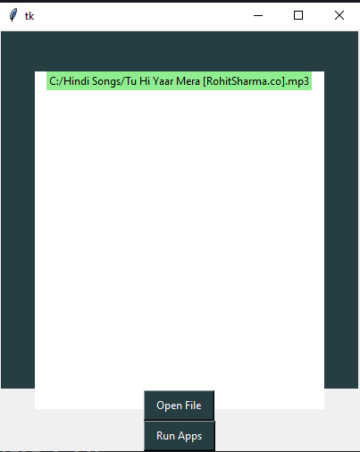

# Music-GUI
Python GUI for playing music from apps like Spotify

# Libraries Used

1. [Tkinter](https://docs.python.org/3/library/tkinter.html)
2. os

# GUI App

# How to Use

**The file can be downloaded from the links above, after downloading, follow these steps:**
1. Go to Command Prompt in Windows or equivanlent in Mac and Linux.
2. Enter command as `python app.py`

**Please upvote my repo if you find it interesting, and do attach your contributions here as well**

**Happy Learning!!**
